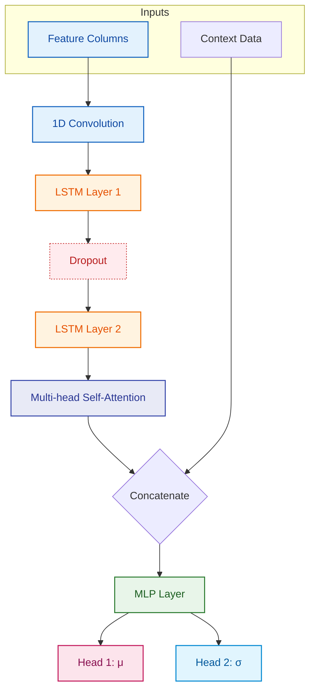

### DOGE Forecasting — Crypto Project

Short pipeline for DOGE/USDT forecasting: data collection, feature engineering, and a probabilistic deep model that predicts mean (`μ`) and uncertainty (`σ`) for next-step returns.

## Table of Contents

- Project overview
- Architecture
- Files
- Data / Schema
- Notebooks
- Quick start
- Model notes
- Volatility-band Backtest
- Repro / Tips
- Next steps

## Project overview

This repository contains the notebooks and data for a DOGE forecasting pipeline: fetch OHLCV with `ccxt`, compute technical indicators and stationary features, then train a probabilistic Conv1D+LSTM+Attention model producing `mu` and `sigma` predictions. I have used these predictions to implement a mean-reversion trading strategy, and use `sigma` as the volatility estimate for risk-weighted position sizing.

## Architecture



## Files

- [DOGE_raw.csv](DOGE_raw.csv) — raw OHLCV export from `get_data.ipynb`.
- [DOGE.csv](DOGE.csv) — preprocessed CSV with engineered features.
- [get_data.ipynb](get_data.ipynb) — data collection from Binance via `ccxt`.
- [preprocess_final.ipynb](preprocess_final.ipynb) — feature engineering (RSI, MACD, BB, ATR, Stoch), cyclic time encodings, and writes `DOGE.csv`.
- [Model.ipynb](Model.ipynb) — dataset class, model, training loop, evaluation including backtest.


## Data / Schema

Raw columns: `timestamp`, `Open`, `High`, `Low`, `Close`, `Vol`.

Engineered indicators include: `Change`, `Change %`, `RSI`, `MACD`, `Signal_Line`, `SMA_20`, `BB_Upper`, `BB_Lower`, `EMA_20`, `BB_Width`, `ATR`, `TR`, `Stoch_%K`, `Stoch_%D`.

Stationary model inputs: `log_return`, `log_range`, `rel_body`, `log_vol_change`, `rsi_norm`, `macd_rel`.

Time context features: `min_sin`, `min_cos`, `hour_sin`, `hour_cos`, `day_sin`, `day_cos`, `month_sin`, `month_cos`.

## Notebooks

- `get_data.ipynb`: download OHLCV and save `DOGE_raw.csv`.
- `preprocess_final.ipynb`: compute indicators, cyclic encodings, prepare `DOGE.csv`.
- `Model.ipynb`: build `BTCDataset`, define `Model` (Conv1D → stacked LSTM → MultiheadAttention → MLP → `mu`/`sigma`), `custom_loss`, training, diagnostics, and optional backtest.

## Quick start

1. Install basics:

```powershell
pip install ccxt pandas numpy scikit-learn torch matplotlib seaborn
```

2. Run `get_data.ipynb` to produce `DOGE_raw.csv` (adjust timeframe/limit as needed).
3. Run `preprocess_final.ipynb` to produce `DOGE.csv`.
4. Open `Model.ipynb` and run training/evaluation (ensure paths point to `DOGE.csv`).

## Model notes

- Inputs: 6 normalized features per timestep and 8 context features.
- Default sequence length: `timesteps = 30`.
- Outputs: `mu` (mean) and `sigma` (scale, enforced positive with `softplus`).
- Loss: custom NLL-like term plus optional MSE regularizer.

## Volatility-band Backtest

The final cell in `Model.ipynb` runs a volatility-band backtest (`run_volatility_band_backtest`) that:

- Builds bands from model-implied sigma: `upper = price * (1 + n_sigma * sigma)`, `lower = price * (1 - n_sigma * sigma)`.
- Entries: long when price < lower band, short when price > upper band.
- Exits: stop-loss / take-profit prioritized, otherwise exit on mean reversion.
- Position sizing: `target_weight = risk_target / sigma`, clipped by `leverage_cap`, converted to units using current wealth and price.
- Outputs a DataFrame with strategy metrics and plots performance vs buy-&-hold.

Run the last cell to produce plots and a `results` DataFrame for analysis.


