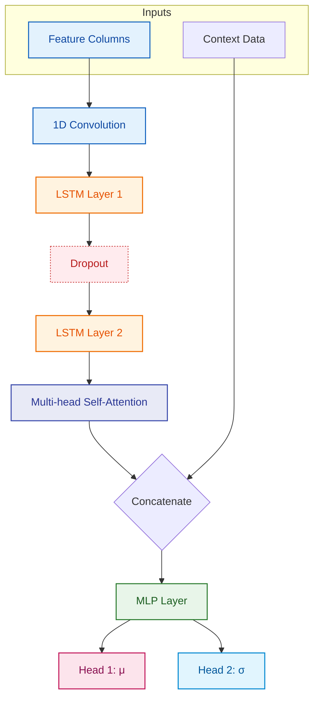

### DOGE Forecasting & Mean-Reversion Trading

End-to-end pipeline for DOGE/USDT on 5-minute bars: data collection,
feature engineering, and a probabilistic Conv1D + LSTM + Attention model
that predicts mean (`μ`) and standard deviation (`σ`) of the next-bar
log-return. The predicted `σ` is then used inside the same notebook to
*gate* mean-reversion entries and to *size* the resulting position.

## Table of Contents

- Project overview
- Architecture
- Files
- Data / Schema
- Notebooks (workflow)
- Quick start
- Model notes
- Volatility-band backtest (in `Model.ipynb`)
- Latest result
- Repro / Tips
- Next steps

## Project overview

Everything --- training, calibration check, backtest, performance
evaluation --- lives inside `Model.ipynb`. The notebook starts with an
**Augmented Dickey-Fuller** sanity check that confirms the mean-reversion
hypothesis (λ < 0) on `log_return` and on the residual
`price − rolling_mean(60)` before any trading. After training, it saves
the best-validation checkpoint to Drive, runs inference on the test slice,
checks calibration, runs the **volatility-band mean-reversion backtest**,
and finally computes strategy Sharpe / CAGR etc.

## Architecture



## Files

| File | Purpose |
|---|---|
| [DOGE_raw.csv](DOGE_raw.csv)                       | Raw OHLCV export from `get_data.ipynb`. |
| [DOGE.csv](DOGE.csv)                               | Preprocessed CSV with engineered features. |
| [get_data.ipynb](get_data.ipynb)                   | Data collection from Binance via `ccxt`. |
| [preprocess_final.ipynb](preprocess_final.ipynb)   | Feature engineering (RSI, MACD, BB, ATR, Stoch) + cyclic time encodings; writes `DOGE.csv`. |
| [Model.ipynb](Model.ipynb)                         | The full pipeline: ADF sanity check, dataset, model, training with early stopping + checkpointing, prediction, calibration, **backtest**, and strategy performance metrics. |
| `doge_attention_vol_best.pt`                       | Best-validation checkpoint produced by the training cell (model state, optimizer state, scaler stats, model hyperparameters). |
| [requirements.txt](requirements.txt)               | Python deps. |

## Data / Schema

Raw columns: `timestamp`, `Open`, `High`, `Low`, `Close`, `Vol`.

Engineered indicators: `Change`, `Change %`, `RSI`, `MACD`,
`Signal_Line`, `SMA_20`, `BB_Upper`, `BB_Lower`, `EMA_20`, `BB_Width`,
`ATR`, `TR`, `Stoch_%K`, `Stoch_%D`.

Stationary model inputs (6): `log_return`, `log_range`, `rel_body`,
`log_vol_change`, `rsi_norm`, `macd_rel`.

Time context features (8): `min_sin`, `min_cos`, `hour_sin`,
`hour_cos`, `day_sin`, `day_cos` *(weekly, based on `dt.dayofweek`)*,
`month_sin`, `month_cos`.

## Notebooks (workflow)

Run in this order:

1. **`get_data.ipynb`** — pulls 100k 5-min DOGE/USDT candles from
   Binance via `ccxt`, writes `DOGE_raw.csv`.
2. **`preprocess_final.ipynb`** — adds RSI / MACD / BB / ATR / Stoch
   indicators, computes the 6 stationary features, builds the 8
   cyclical time features (including weekly `day_sin/cos` based on
   `dt.dayofweek`), writes `DOGE.csv`.
3. **`Model.ipynb`** — end-to-end. Sections in order:
   - **ADF mean-reversion sanity check** — hand-rolled OLS regression
     to confirm λ < 0 on `log_return` and on `price − rolling_mean(60)`
     before any trading.
   - **`BTCDataset`** — 70/15/15 chronological split, scaler fit on
     **train slice only** (no leakage). Optionally rebuild from
     checkpoint scaler stats.
   - **`Model`** — Conv1D → 2× LSTM → multi-head attention → MLP →
     dual μ/σ heads.
   - **`train()`** — early stopping on validation Gaussian NLL.
     Every new-best epoch writes `{model_state, optimizer_state,
     val_nll, model_hparams, scaler_mean, scaler_scale,
     feature_cols, context_cols}` to
     `/content/drive/MyDrive/doge_attention_vol_best.pt`.
   - **`load_checkpoint()`** — restores weights *and* scaler stats so
     a fresh kernel can resume inference without retraining.
   - **`predict_and_evaluate()`** — inference on the test slice;
     prints test NLL and calibration (within-1σ / 2σ).
   - **Diagnostic Sharpe of the raw forecast** (`μ/σ`) — labelled
     clearly as *not* the strategy Sharpe.
   - **Volatility-band backtest** — full mean-reversion strategy
     with risk-weighted sizing, SL/TP, mean-revert exits, and a
     configurable round-trip transaction cost. **This is the main
     backtest.**
   - **Strategy performance** — realised Sharpe / CAGR / MaxDD /
     time-in-market / position-flips of the equity curve.

## Quick start

```powershell
pip install -r requirements.txt
```

Then run `get_data.ipynb` → `preprocess_final.ipynb` → `Model.ipynb`
top to bottom. Training defaults to 40 epochs with patience 5; the
best-validation checkpoint is auto-saved on each improvement.

To **skip training** and reuse a saved checkpoint:
1. Run cells 1–10 (imports, dataset, model class, `custom_loss`,
   `load_checkpoint` definition).
2. Skip cells 11–13 (the `train()` definition and its invocation).
3. Run cell 15 (`predict_and_evaluate`) — it calls `load_checkpoint`
   internally and restores both weights and scaler from the `.pt`
   file.
4. Run the downstream calibration → backtest → metrics cells as
   normal.

## Model notes

- Inputs: 6 stationary features × 30 timesteps + 8 context features
  (no time-of-day leakage thanks to cyclical encoding).
- Outputs: `μ` (mean log-return) and `σ` (scale, enforced positive
  with `softplus`).
- Loss: Gaussian NLL with a small MSE regulariser during training;
  **pure NLL** on the validation slice for model selection.
- Training writes to a single best-validation checkpoint --- not
  per-epoch, not on every improvement noisy enough to overshoot.
- Inference re-uses the *checkpoint's* scaler stats, so a restored
  model sees inputs exactly as they were during training.

## Volatility-band backtest (in `Model.ipynb`)

The backtest cell (≈ cell 22 of `Model.ipynb`) defines
`run_volatility_band_backtest(mu, sigma, prices, ...)` and runs it on
the test-slice predictions. The strategy:

- **Bands**: `upper = price × (1 + n_sigma × σ_arith)`,
  `lower = price × (1 − n_sigma × σ_arith)`, where `σ_arith` is the
  log-normal arithmetic standard deviation derived from the model's
  log-space `(μ, σ)` via
  `σ_arith = √(exp(σ²)−1) × exp(μ + σ²/2)`.
- **Entry**: long if price < lower band, short if price > upper band.
- **Exits** (priority): stop loss → take profit → mean-revert (price
  back inside the bands).
- **Sizing**: `target_weight = risk_target / σ_arith`, clipped at
  `leverage_cap`. Converted to units using current wealth and price.
- **Cost**: configurable round-trip in basis points (default 10 bps;
  the latest run uses 4 bps), split 50/50 across entry and exit fills.

The cell *after* the backtest computes:

- **`evaluate_strategy_performance(results)`** — Sharpe, CAGR, max
  drawdown, per-bar mean/std, time-in-market, and position flips of
  the realised equity curve. This is the only post-backtest metric
  block; the previous directional / hit-rate / conviction-weighted
  signal-quality block has been removed.


## Latest result

Run parameters (from the final invocation in `Model.ipynb`):

```
initial_wealth         = 5000
n_sigma                = 4
risk_target            = 0.03
leverage_cap           = 6.0
stop_loss_pct          = 0.005    (0.5%)
take_profit_pct        = 0.03     (3%)
cost_bps_round_trip    = 4 bps
```

Test slice: 14,996 5-minute bars (~52 days).

| Metric | Value |
|---|---|
| Total return            | **+19.11%** |
| CAGR                    | +240.64% (cosmetic — 52-day extrapolation) |
| Sharpe (annualised)     | +1.62 |
| Max drawdown            | −34.79% |
| Per-bar mean            | +0.187 bps |
| Per-bar std             | 37.31 bps |
| Time in market          | 10.7% |
| Position flips          | 2,797 |
| Buy & Hold (DOGE)       | −22.6% |
| Calibration (within 1σ) | 72.8% (expected 68.2%) |
| Calibration (within 2σ) | 94.1% (expected 95.4%) |

The model is well-calibrated and the strategy clearly beats Buy & Hold
(+19.1% vs −22.6%) over this window, but the −34.8% drawdown and high
flip count tell you the tight 0.5% stop is firing constantly at 6×
leverage. The 52-day window is also too short to call this a stable
Sharpe.

## Repro / Tips

- `StandardScaler` is fit on the **train slice only** (`BTCDataset`
  takes `train_frac` and `val_frac` and respects them).
- `torch.load(..., weights_only=False)` is required because the
  checkpoint contains numpy arrays (scaler stats). Safe because *you*
  wrote the file.
- `add_safe_globals([...])` is also registered as a fallback in
  case `weights_only=True` is forced.
- Re-run `preprocess_final.ipynb` once after any feature change; the
  model assumes the engineered columns are present in `DOGE.csv`.
- Keep `Model.ipynb` and `doge_attention_vol_best.pt` together; the
  checkpoint stores the exact scaler stats and hyperparameters used.

## Next steps

Highest-leverage improvements, ranked:

1. **Walk-forward retrain** — train on the first 70%, sweep params on
   a held-out 15% validation slice, evaluate forward on the final 15%
   slice the pipeline has never seen. Tells you whether the
   current Sharpe is real or in-sample tuning luck.
2. **σ-scaled SL/TP** — replace fixed `0.5%` / `3%` stops with
   multiples of predicted `σ_t` so the stops breathe with the
   volatility regime.
3. **Volatility regime gate** — skip new entries when
   `σ_t / mean(σ over rolling window)` exceeds a threshold; the
   strategy fails in turbulent unstable regimes.
4. **Fractional-Kelly sizing** — use both `μ` and `σ`:
   `f ∝ |μ| / σ²`, capped. Sizes confident bets large and weak bets
   small instead of always saturating at the leverage cap.
5. **Move to 15m or 1h bars** — same model architecture, fewer fills
   per day, makes the alpha-to-fee ratio survive realistic taker
   costs.
